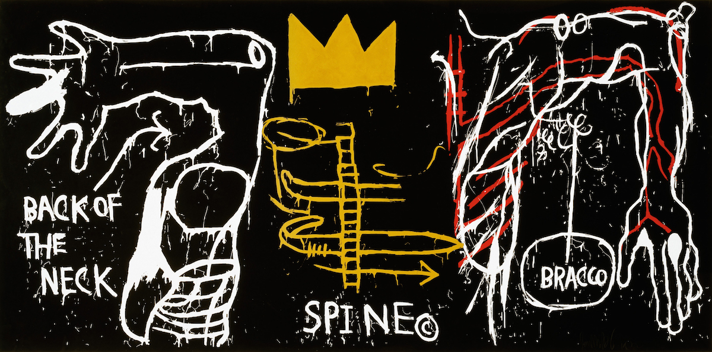
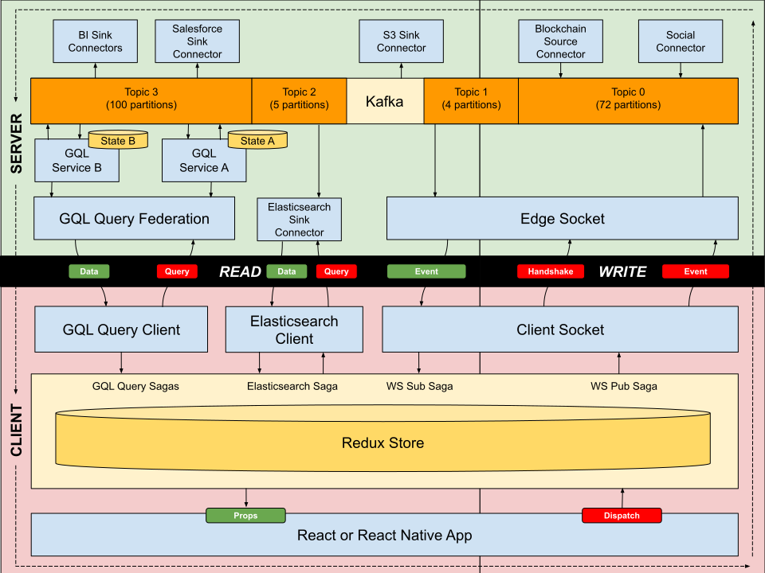

# SAMO

A reference archiecture dedicated to the work of Jean-Michel Basquiat.

## What

A server-side architecture with properties of microservices, CQRS, Redux Saga and PubSub.

- Scales processing units independently
- Separates read and write operations
- Publishes realtime events
- Purifies code by describing effects as data
- Deploys to any kubernetes cluster with a single command

## Glossary

To better understand this architecture, let's define a few terms:

- **Edge View**: A federated GraphQL endpoint exposing a unified, query-only interface to all views.
- **View**: A GraphQL endpoint exposing a particular slice of the graph.
- **Query**: A normal GraphQL query.
- **Edge Socket**: A dual-channel SocketIO socket exposed to clients.
- **Socket**: A dual-channel SocketIO socket exposed to the edge socket.
- **Action**: A message sent to the edge socket by a client. Also called a "command" in the CQRS architecture. Actions are used to *WRITE* to state.
- **Saga**: A series of steps taken in response to an action.
- **Step**: A single computation as part of a saga.
- **Event**: A message sent from any socket or view. Some events can be broadcast to server-side or client consumers. They can be sent to all consumer, a namespace containing many consumers or an individual consumer. Events are used to *READ* from state.
- **Effect**: An impure instruction which uses or modifies external state.
- **Interpreter**: A subsystem which actually executes effects. This allows code to be written and tested without side-effects.
