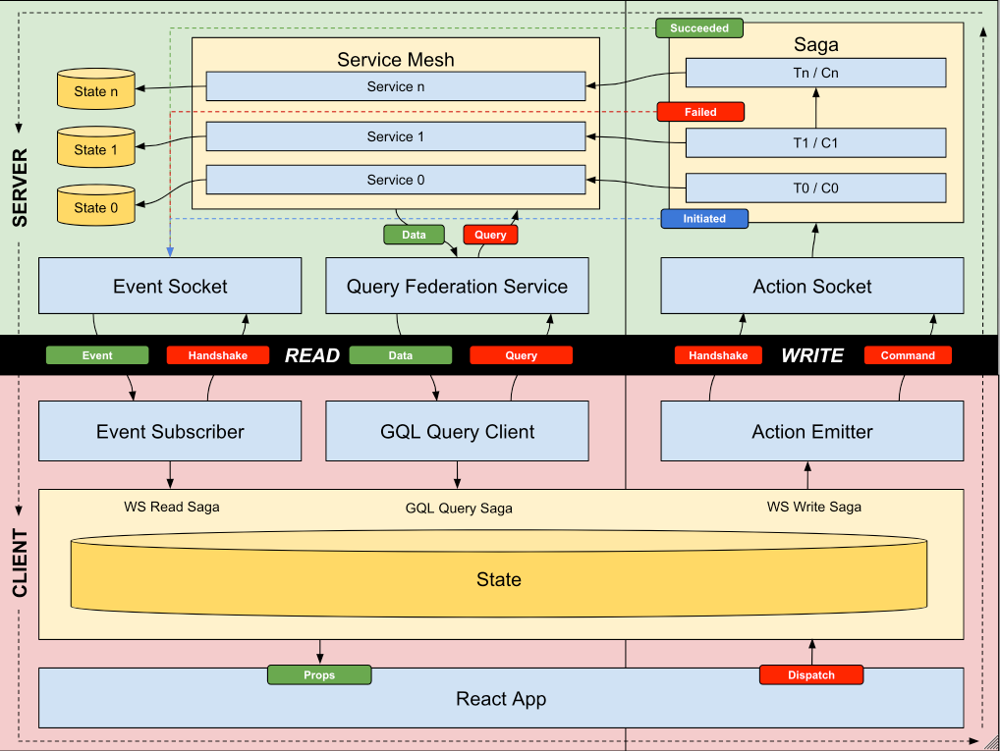

# AQuEOSS
Action Query Effect-Oriented Socket Server

## What?

A server-side architecture inspired by microservice architecture, CQRS, Redux Saga and PubSub.

- Scales processing units independently
- Separates read and write operations
- Publishes realtime events
- Purifies code by describing effects as data
- Deploys to any kubernetes cluster with a single command

## Vocbulary

To better understand this architecture, let's first define a few terms:

- **Query Federation**: A GraphQL edge exposing a unified, query-only interface to all view projections.
- **Query**: A normal GraphQL query.
- **Edge Socket**: A normal dual-channel SocketIO socket exposed to clients.
- **Action**: A messages sent to the write channel of the edge socket. Also called a "command" in the CQRS architecture.
- **Event**: A messages sent from the read channel of the edge socket.
- **Saga**: A series of steps taken in response to an action.
- **Step**: A single computation as part of a saga.
- **Effect**: An instruction (impure) which uses or modifies external state.

VIEW PROJECTOR
-----------------------------------------------------------
  persist state
  emit PROJECTION_UPDATED event (effect)

